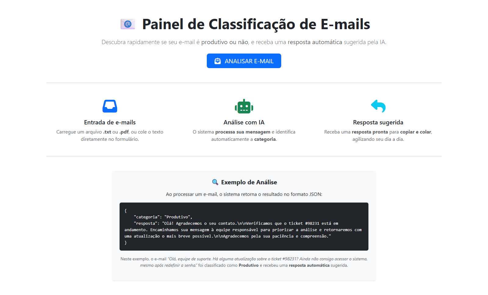
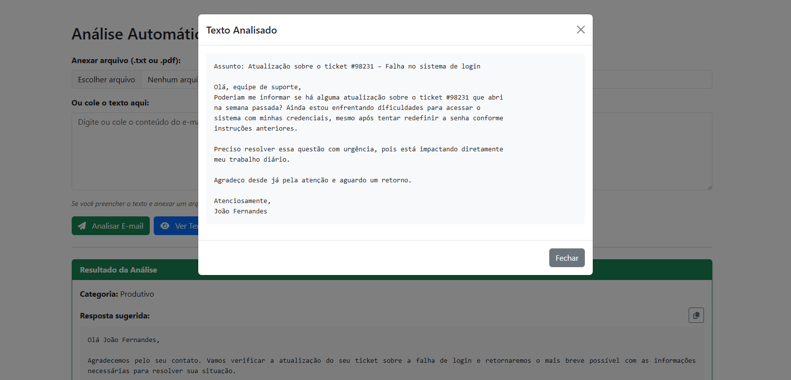
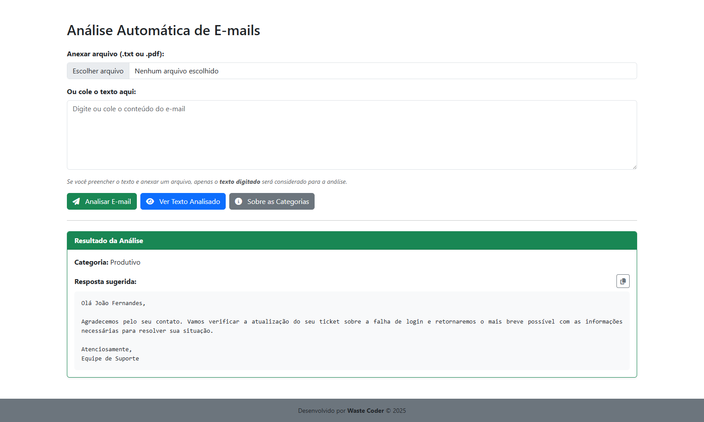

# 📧 Classificador e Gerador de Respostas para E-mails

Este projeto foi desenvolvido como parte de um **teste prático de processo seletivo**.

O desafio consiste-se em criar uma solução digital para uma **empresa do setor financeiro** que lida com um **alto volume de e-mails diariamente**.
Muitos deles são **produtivos**, como solicitações de suporte ou atualizações sobre casos em andamento,
mas outros são **improdutivos**, como mensagens de felicitações ou agradecimentos sem necessidade de ação.

O objetivo da aplicação é **automatizar a leitura, classificação e sugestão de respostas para e-mails recebidos**, permitindo que a equipe da empresa **ganhe tempo** e reduza o esforço manual nesse processo.

Os e-mails são classificados em duas categorias principais:
- **Produtivo:** E-mails que requerem uma ação ou resposta específica.
  - Solicitações de suporte técnico
  - Atualizações sobre casos abertos
  - Dúvidas sobre o sistema
- **Improdutivo:** E-mails que não necessitam de ação imediata.
  - Mensagens de felicitações
  - Agradecimentos simples
  - Perguntas irrelevantes

Entre as principais entregas da aplicação estão:
- **Interface web simples** para upload de arquivos `.txt` ou `.pdf`, ou inserção direta do texto.
- **Classificação automática dos e-mails** como Produtivo ou Improdutivo.
- **Sugestão de resposta automática** baseada na categoria detectada.
- **Exibição imediata dos resultados** na tela, incluindo a categoria, o texto sugerido de resposta e o conteúdo processado.
- **Deploy em nuvem** para acesso externo.
- **Testes automatizados** cobrindo a camada de serviço.


---


## 📂 Estrutura do Projeto
```
python-flask-email-classifier/
├── app/
│   ├── __init__.py
│   ├── routes.py
│   └── services/
├── templates/
│   ├── index.html
│   ├── email/
│   ├── layouts/
│   └── partials/
├── static/
├── assets/
├── tests/
├── run.py
├── requirements.txt
├── .env
└── README.md
```


---


## Funcionalidades

### Frontend
- [x] Formulário para upload de arquivos **TXT** ou **PDF**, além de campo de texto (textarea) para colar o email.
- [x] Exibição do resultado da análise: **categoria do email** e **resposta sugerida**.
- [x] Modal para visualizar o texto enviado que foi analisado.
- [x] Modal com a explicação das duas categorias (**Produtivo** e **Improdutivo**).
- [x] Uso de **Bootstrap** para visual moderno e responsividade.
- [x] Validação em **JavaScript** para impedir envio de formulários vazios.
- [x] Função em **JavaScript** para copiar a resposta sugerida.
- [x] **Toast Notification** para feedback do usuário:
  - Formulário vazio (validação no front e no back).
  - Arquivo maior que **5 MB**.

### Backend
- [x] Leitura de arquivos **.txt** e **.pdf**.
- [x] Pré-processamento de texto com NLP:
  - Converte para minúsculas.
  - Remove caracteres especiais, pontuação e tudo que não seja letra/espaço.
  - Aplica **lematização** com modelo em português.
- [x] Classificação do email como **Produtivo** ou **Improdutivo** usando **OpenAI**.
- [x] Geração de resposta automática com **OpenAI**, de acordo com o conteúdo do email.
- [x] Categorização e resposta realizadas em **um único prompt** (otimização de tokens).
- [x] Limite de 200 tokens configurado nas respostas da API da OpenAI.
- [x] Bloqueio de upload de arquivos maiores que 5 MB no backend.
- [x] Adição de docstrings nos arquivos `.py` para documentação e melhor entendimento do código.
- [x] **Testes unitários** com **Pytest** para a camada de serviços (`classifier.py`, `preprocess.py`, `extractor.py`).

### Deploy
- [x] Configuração de dependências com `requirements.txt` gerado via `pip freeze`.
- [x] Configuração de variáveis de ambiente: `PORT` e `OPENAI_API_KEY`.
- [x] Deploy realizado no **Render**.


---


## ⚙️ Tecnologias Utilizadas

- **Flask:** Framework web utilizado para estruturar a aplicação e expor a interface.
- **PyMuPDF:** Leitura e extração de conteúdo de arquivos PDF.
- **spaCy:** Biblioteca de NLP para pré-processamento de texto (remoção de stopwords, pontuação, lematização e tokenização).
- **OpenAI API (GPT-4o-mini):** Responsável pela classificação (Produtivo/Improdutivo) e pela geração de respostas automáticas.
- **JSON:** Estrutura para troca de dados, usada para ler as respostas da OpenAI.  
- **Pytest:** Framework de testes para validar os serviços de extração, pré-processamento e classificação.  
- **Dotenv:** Carrega variáveis de ambiente a partir de um arquivo `.env`.  
- **Waitress:** Servidor WSGI em Python usado no deploy da aplicação.  
- **Render:** Plataforma de nuvem utilizada para hospedar e disponibilizar a aplicação.


---


## 🖼️ Imagens da Aplicação

### Página inicial


### Texto enviado para análise


### Resultado da análise: categoria e resposta sugerida


> Outras imagens da aplicação estão disponíveis em [assets/ui_screenshots](https://github.com/wastecoder/python-flask-email-classifier/tree/main/assets/ui_screenshots)


---


## 🔮 Possíveis Melhorias

### Nova categoria “Irrelevante”
- Separar emails improdutivos em duas classes:
  - **Improdutivo (responde):** felicitações, agradecimentos.
  - **Irrelevante (ignora):** spam, promoções, golpes.
- A resposta automática a e-mails irrelevantes seria "N/A".

### Histórico de emails processados
- Guardar os resultados em uma lista local ou banco leve, como SQLite.
- Permitir ao usuário consultar classificações anteriores.

### Autenticação simples
- Implementar um sistema básico de login para restringir o acesso à aplicação.
- Garantir que apenas usuários autenticados possam enviar e analisar emails.

### Dashboard simples
- Exibir métricas gerais, como quantidade de emails produtivos, improdutivos e irrelevantes.
- Mostrar informações adicionais, como os usuários que mais realizaram análises.


---


## 🚀 Como Executar  

### 🔹 Deploy Online

A aplicação está disponível online através do **Render**:

👉 [Acesse aqui a versão online](https://python-flask-email-classifier.onrender.com/)


### 🔹 Executando Localmente

#### 1. Pré-requisitos:
- Python 3.10 ou superior
- Conta e chave de API no [OpenAI](https://platform.openai.com/)
 
#### 2. Clone o repositório
```bash
git clone https://github.com/wastecoder/python-flask-email-classifier.git
cd python-flask-email-classifier
```

#### 3. Crie e ative um ambiente virtual
```bash
python -m venv venv
source venv/bin/activate   # Linux/Mac
venv\Scripts\activate      # Windows
```

#### 4. Instale as dependências
```bash
pip install -r requirements.txt
```

#### 5. Crie um arquivo `.env` na raiz do projeto com o seguinte conteúdo:
```env
OPENAI_API_KEY=sua_chave_aqui
```

#### 6. Execute a aplicação
```bash
python run.py
```

> A aplicação ficará disponível no [localhost](http://127.0.0.1:5000/)


### 🔹 Executando testes

Faça os passos de 1 a 5 da seção [Executando Localmente](#executando-localmente) para garantir que o ambiente está preparado.

Depois, execute o seguinte comando para rodar os testes automatizados:

```env
python -m pytest -v
```

> OBS: Não é necessário iniciar o servidor da aplicação (`python run.py`) para rodar os testes.
